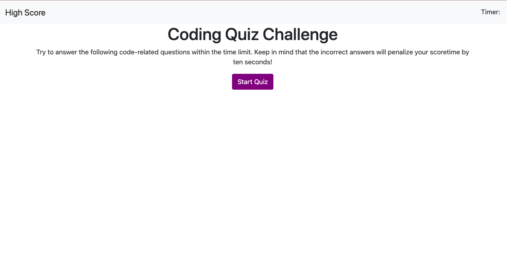
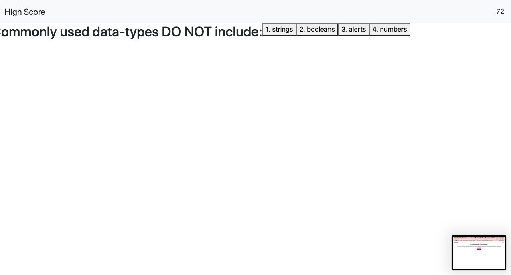
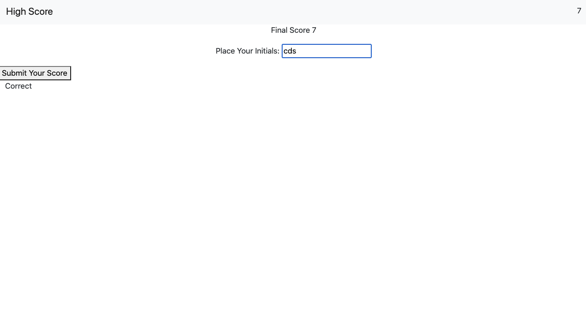

# code-quiz

## Description

This codebase is constructed via JavaScript and HTML DOM to provide a dynamic code quiz pulled from the web API. The light, minimalist structure provided by both Boostrap and div containers coded out in HTML provides a visually smooth user experience. Each question and selection of answers are pulled from a a consolidated array that's stored within a variable and appended to their respective divs stored in the HTML file. The quiz is time and automatically transitions from one question to the next after each answer is clicked. If the user clicks a wrong answer 15 seconds is deducted from the time. After the quiz is done, a page appears prompting for the user to input their initals for it to be store in the local storage on the back end of the website. Then the next with the user's high score appears that asks the user to confirm their high score or return back to the homepage to start the quiz all over again.

## Screenshot:

## URLS

* 
* 

## Sources
* 
* 
*  
